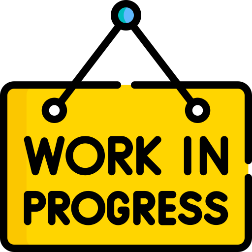

<h1 align="center">
<!--  
Datenschmutz.dev
 -->
  
</h1>

<h3 align="center">

Our website provides a wide range of calendars featuring a variety of events that can be easily synced with your calendar app of your choice.

</h3>

<h3 align="center">
 

We are just starting with this site. Please participate and share your knowlegde e.g. for tools not covered, errors or improvements.

</h3>

# Contributors
<h3 align="center">

</h3>

# Contributing
<h3>

You' ve found a bug or can add something to a documentation? Feel free to use the -Edit this page- button at the bottom of the page or start a Pull request directly from GitHub and share your knowledge with others! Look <a href="./CONTRIBUTING.md">here</a> to get more information on how you can contribute

</h3>

<h3>

This Website is Built with ❤️ and <a href="https://github.com/facebook/docusaurus">Docusaurus</a>.

</h3>
